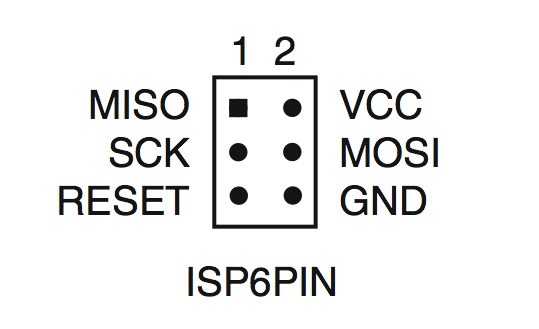

AVR-Grundschaltung
==================

Grundschaltung AVR
------------------

* 2.7V - ~5V an VCC (ggf. auch AVCC)
* GND (ggf. auch AGND)
* Stützkondensator 100µF zwischen VCC und GND (möglichst nahe an µC)
* Reset mit Pull-Up Widerstand 10kOhm gegen VCC; ggf. Reset-Taster an GND
* Falls nicht interner Oszillator: Quarz 8Mhz an XTAL1/2 und mit jeweils 22pF Kondensatoren gegen GND
* ISP: siehe unten

ISP
---

Links
-----
* http://www.mikrocontroller.net/articles/AVR-Tutorial:_Equipment
* http://rn-wissen.de/wiki/index.php/AVR-Einstieg_leicht_gemacht
* http://www.kreatives-chaos.com/artikel/avr-grundschaltungen
